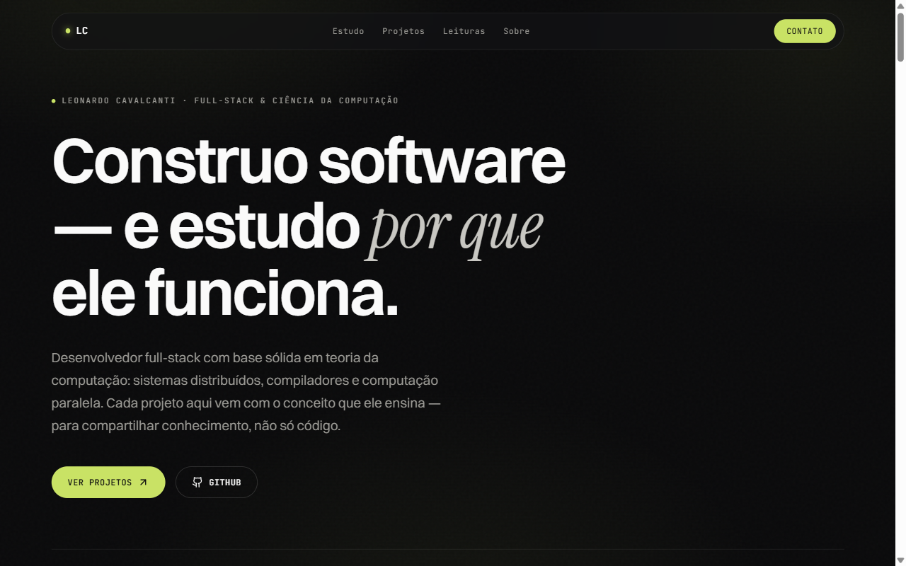

# Portfólio — Leonardo Cavalcanti


Portfólio pessoal com identidade editorial: fundo quase-preto, verde-limão ácido como único acento e tipografia que mistura **Switzer** (display) com **Instrument Serif** (itálico) e **JetBrains Mono** (rótulos). Single-page com scroll suave e revelações escalonadas.

O viés é **acadêmico**: cada projeto é apresentado junto ao conceito de Ciência da Computação que ele estuda, e há uma seção de **leituras de referência** — a ideia é compartilhar conhecimento com quem visita o perfil, não só listar trabalhos.

**🔗 Ver ao vivo: [leonardopcavalcanti.github.io/portfolio](https://leonardopcavalcanti.github.io/portfolio/)**

[](https://leonardopcavalcanti.github.io/portfolio/)

## Destaques

- **Foco acadêmico:** seção "Áreas de estudo" (cards numerados) e seção "Leituras de referência" (Lamport, Dragon Book, Amdahl, Kleppmann…); cada projeto traz o conceito que ensina.
- **Acessibilidade real:** suporte completo a `prefers-reduced-motion` — animações de entrada e revelações são neutralizadas, preservando o conteúdo.
- **Motion proposital:** entrada do hero em _stagger_ via Framer Motion (opacity + translateY + blur, easing `easeOutExpo`) e reveal-on-scroll via `IntersectionObserver`.
- **SEO & social:** meta tags Open Graph/Twitter e cartão social (`og-image.svg`).
- **Tipado de ponta a ponta**, sem `any`, com ESLint + Prettier; build limpo (`tsc && vite build`).
- **CI/CD:** deploy automático no GitHub Pages a cada push em `main`.

## Stack

- **React 18 + Vite + TypeScript**
- **Tailwind CSS v3**
- **Framer Motion** · **Lucide React**
- **React Router DOM v6**
- Fontes: **Switzer** (Fontshare) + **Instrument Serif** + **JetBrains Mono** (Google Fonts)
- Deploy: **GitHub Pages** via GitHub Actions

## Desenvolvimento

```bash
npm install      # instala dependências
npm run dev      # servidor de desenvolvimento (http://localhost:5173/portfolio/)
npm run build    # build de produção (tsc + vite build)
npm run preview  # preview do build
npm run lint     # ESLint
npm run format   # Prettier
```

## Deploy

O deploy é automático: cada push para `main` dispara o workflow
`.github/workflows/deploy.yml`, que faz `npm ci → npm run build` e publica a
pasta `dist/` no GitHub Pages.

> O `base` do Vite e o `basename` do Router estão configurados como
> `/portfolio/`, coincidindo com o nome do repositório. Se o repo for renomeado,
> ajuste `base` em `vite.config.ts`.

Alternativa manual: `npm run deploy` (usa `gh-pages`).

## Estrutura

```
src/
├── components/
│   ├── layout/      Header (nav de vidro), Footer (logo grande)
│   ├── ui/          RevealOnScroll
│   └── sections/    Hero, FocusAreas, Projects, References, About, Skills, Contact
├── data/            projects, focusAreas, references, skills, experience
├── hooks/           useReveal
├── styles/          globals.css
└── types/           interfaces compartilhadas
```

## Notas de design

- **Cores:** `#0a0a0b` (fundo) · `#fafafa` (texto) · `#c9e265` (acento limão) · `#9a9994` (muted) · `#131316` (painel)
- **Tipografia:** títulos em Switzer 600 com acentos em Instrument Serif itálico; rótulos e nomes de arquivo em JetBrains Mono.
- **Navegação** em "pílula de vidro" (backdrop-blur) flutuante.
- **Atmosfera:** brilhos limão muito tênues + grão fino em pseudo-elementos do `body`.
- Linguagem visual inspirada na estética editorial da [wibify.agency](https://wibify.agency).
